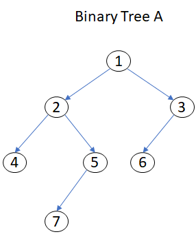

# Algorithms & Data structures

## INTRODUCTION TO ALGORITHMS

Most people don't realize this simple fact but, we all deal with algorithms on a daily basis. An algorithm is defined in Webster's dictionary as "a process or set of rules to be followed in calculations or other problem-solving operations, especially by a computer: "

The first part is what you may be able to relate to. A process. A process that is followed to accomplish something. A recipe with instructions for how to mix and bake a cake in an oven is a process and is also an algorithm. It is a set of steps or rules to follow for a successful outcome.

There is a key piece of information missing in the above definition that is critical. The algorithm should produce the correct result. Does it have to do this all the time? Of course, it should, or we should find another algorithm that does produce the correct result every time.

As an example, consider a typical morning routine where you wake up and get ready for work or school. Let's list the steps that you might go through for this routine:

Alarm clock wakes you (you decide to wake up and get ready for the day, or not)
You shower
You dress for the day
You potentially eat breakfast
You leave the house and head to work or school
If you perform these steps in order and you arrive at your destination, then the algorithm is correct in the way it is written above. It is a process or set of rules that you follow to successfully get up in the morning and head to work. What happens if this algorithm isn't quite right?

Consider if you reversed steps 2 and 3 above. You can still arrive at work but is the algorithm producing a correct result? You arrive at work in wet clothes so perhaps, it's not quite right.

In programming, you will be formulating algorithms on a regular basis. This lesson will help you start thinking about algorithms and how you can evaluate the steps needed to accomplish a task, create a working algorithm, translate that to code, and then test it to make sure it is correct.

## BUBBLE SORT
The first sorting algorithm we will look at is the bubble sort. There is no specific reason to cover this first, we are simply covering the three sorting algorithms in alphabetical order in this lesson.

Before we dive into the bubble sort algorithm, let's stop and consider the act of sorting items or objects. For this discussion, let's consider that we need to sort a stack of bouncy balls. In order for the bouncy balls to look good and sit correctly inside the tube, we want to place the larger sized ones on the bottom and smaller ones on the top. We can consider this an ascending order or smallest to largest, when viewed from the top to bottom.

Now that we have that mental picture, consider that you are given that stack of bouncy balls but in a random order. You need to sort them by placing the largest on the bottom and smallest on the top. Think about how you approach this as a task. You will likely seek out the visibly largest bouncy ball and try to place it on the bottom. Or, you might seek out the smallest and place it on the top. However you decide to perform your manual sorting, you will be performing a comparison of the sizes of the bouncy balls.

In a computer program, there is no "visual" ability to see the largest of smallest bouncy ball, or object. You have to deal with size factors but you need a way to compare one item against another based on size. For our example, we will use numbers as they are easily represented in simple programs and good for teaching concepts.

Let's say that we have a collection of numeric values that range from 1 to 25, but are not consecutive and certainly are not in any specified order. How do we sort this collection of numbers? We look at two numbers and determine if one is smaller than the other, or larger, either way, we are comparing the size. If we want to sort the numbers in the collection in ascending order, that means we want to smaller numbers toward the top. As we compare two numbers, we will perform a position swap to place the smaller number before the larger number. But where do we start and how do we know when we are finished? Each of the three sort methods we cover will address these two points.

So what does a bubble sort do and how do we implement it to sort our list of numbers? Well, the name itself should give away some idea of how it will function. We "bubble" the smaller numbers up to the top. Much like a lighter object could "bubble" up to the top of a stack of items. The bubble sort will work through the collection of numbers, comparing and possibly exchanging adjacent numbers. For this exchange to take place, we swap the location of the two numbers. Here is a visual for reference.

3, 1, 7, 5, 9, 10 is an unsorted list of numbers. One the first pass, 3 and 1 are compared and we find that they are out of order because 1 is smaller than 3. We assume we want to sort smallest on the left and largest on the right.

After the first comparison and swap, we find the list now shows 1, 3, 7, 5, 9, 10. We can now compare 3 and 7. They are in the proper order so we do nothing but on the next comparison, we note that 5 and 7 need to be swapped. In the end we would have the list in order from left to right asa 1, 3, 5, 7, 9, 10.

There is a key piece in this process called the swap or the exchange. We have to allow for this in our algorithm. So, let's write some pseudocode to represent a bubble sort routine.

bubbleSort( nums : list of sortable items )
n = length(nums)
loop
   swapped = false
   for i = 1 to n-1 // setup number of iterations equal to length of list - 1
      // is swap needed?
      if nums[i-1] > nums[i] then // swap them and note it by setting swapped bit
         swap( nums[i-1], nums[i] )
         swapped = true
      end if
   end for
until swapped is false or end of list size
end bubblesort

Let's convert this into C# code. Enter this code into a C# console application and run it using CTRL + F5 to see the results.

NOTE: It is highly recommended that you place a breakpoint on the beginning line of code and then use F5 or Start with Debugging if you want to follow the steps one line at a time and watch how the algorithm functions.

// declare an array of integers that are not sorted
int[] nums = { 5, 10, 3, 2, 4 };

// Output the unsorted array to the console
Console.WriteLine("Before: 5, 10, 3, 2, 4");

 // Use this to know when to stop the sorting routine
bool swapped;

// Here we use a do loop but could have used for or while loops as well.
do
{
    // set swapped to false so that we can ensure at least one pass on the array
    swapped = false;

    // This loop will iterate over the array from beginning to end
    for (int i = 0; i < nums.Length - 1; i++)
    {
        // here we use the i for the position in the array
        // So i is the first value to compare and i + 1 compares the adjacent value
        // Once i is incremented at the end of this loop, we compare the next two sets of values, etc.
        if (nums[i] > nums[i + 1])
        {
            // swap routine.  Could be a separate method as well but is used inline for simplicity here
            // temp is used to hold the right value in the comparison so we don't lose it.  That value will be replaced in the next step
            int temp = nums[i + 1];

            // Here we replace the right value with the larger value that was on the left.   See why we needed the temp variable above?
            nums[i + 1] = nums[i];

            // Now we assign the value that is in temp, the smaller value, to the location that was just vacated by the larger number
            nums[i] = temp;

            // Indicate that we did a swap, which means we need to continue to check the remaining values.
            swapped = true;
        }
    }
} while (swapped == true);

// output the sorted array to the console

Console.Write("After: ");
for (int i = 0; i < nums.Length; i++)
{
    Console.Write("{0}, ", nums[i]);
}

// Use Console.ReadLine() in the event application was started with debugging.
Console.ReadLine();

## INTRODUCING SEARCH ALGORITHMS
What is a search algorithm? It is a recipe, or process, for retrieving information from a source. When you search on Bing or Google, these search engines retrieve information about the topic you used, from various sources.

The "sources" could be your data structures such as arrays, linked lists, etc. They might be a file such as an Excel spreadsheet or an XML or JSON file. Perhaps you are searching a relational database as a source.

Your algorithm for the search must meet certain requirements:

correctness - it must return the correct results that are being sought, every time
applicability - it must be appropriate for the source type and data needs
speed - it must execute in a timely manner based on your requirements for searching
In this lesson, we will cover two common search algorithms, the linear search and the binary search (also sometimes known as the half-interval search).

## LINEAR SEARCH
A linear search, also known as a sequential search, will search from a starting point, through the items, until it either finds the item or has searched through the entire source. This source is typically a list. As an example, if we had a list of numbers from 1 through 10 (1, 2, 3, 4, 5, 6, 7, 8, 9, 10) and we were searching for 5, the search would continue in a linear fashion, that is from 1 through to 5. Once it found 5, the search would stop. If we searched for 10, we would go through the entire list until we found 10 at the end. Of course, you might ask why would we not set the search start at a value other than the beginning of the list. We could, but if the list is not sorted and we didn't start at the beginning, we might miss the value we are looking for.

The basic through process in a linear search is this:

set a counter equal to 0
check the item at position (counter) and if it equals search term, end the algorithm
if search term is not found in step 2, increment counter and repeat step 2

## ALGORITHM ANALYSIS
What is algorithm analysis and why is it important? Stated simply, algorithm analysis is the act of evaluating how quickly the algorithm will operate based on the range of inputs. If that doesn't make sense, let's expand a bit more.

You have seen an example of two search algorithms. Which one was the fastest at finding the value? It depends, right? It does. Typically the binary search will be faster than the linear search but not always. What if the value you wanted to find in the array was the very first value? The search would be very quick and the linear search would actually be faster than the binary search in this instance. But what happens if the value we want to find is at the end of the array? The Linear search is now the slowest.

Essentially, algorithm analysis is where you look at the size of the input (array size for example), and how long it takes to perform the single comparison in the search, as a starting point. You know that a comparison of values is a fixed amount of time. But you also know that the more you have to execute that comparison, the more time it takes. That is where the size of the input comes into play.

You also will need to evaluate something called best case, average case, worst case. Best case is best illustrated by considering a search algorithm. If we use the linear search concept we know that we must do at least one comparison, otherwise we haven't searched. If we find the search term on the first comparison, the routine is done. This is the best case because the search cannot be any shorter than this.

Worst case is also illustrated best with the linear search and considering the fact that we don't find the search term until the end of the array. We must compare EVERY value in the array and that will take the longest amount of time for the size of the array. Essentially, worst case has a large dependency on the size of the array or input that we give it. It is the maximum amount of time that the search could take.

Average case is, as it sounds, an average of the amount of time it takes to search the array or list or whatever, based on sample inputs and averaging the search times across those values.

You never use a time estimate based on best case because that is not always realistic and using worst case is not always correct either because we know that will only occur periodically. So average case is what we use to determine which algorithm will produce the most acceptable time based on expected input sizes.

### It's important to note that this course and this module specifically, are not intended to teach algorithm analysis in detail. The content will help you understand some of the basic concepts of algorithm analysis but we do not cover the mathematics involved in Big O notation or how the various notations are derived in mathematical terms. If you want to study this subject deeper a search on Bing or Google will provide various resources for more study on the topic.

## LAB

You have seen a demo of the bubble sort routine in Visual Studio already. For this tutorial lab, you will use the debugging facilities in Visual Studio to step through the insertion sort routine to gain an understanding of how it works. You will also find some self-check questions that will help determine if you have understood what is taking place in the routine.

Download the Algorithm_Demos.zip file
Expand the DemoCode solution
Note that this is a Visual Studio 2017 project. If you are using a different IDE to complete this course, you will need to open the Program.cs file in this archive and use a copy/paste for the code into your IDE.
If you are using Visual Studio 2017, open the project file
Program.cs should open automatically, if not, open the file
You will see multiple regions in this file for each sort and search algorithm covered
Click the + sign next to Insertion Sort to expand that region
Select all of the text in green
Press CTRL + K CTRL + U to uncomment all of that code. (Note, there are multiple comments in this region that should remain green after performing this step. That is ok as they are comments about the code operation. Leave them as comments.)
Press CTRL + F5 to run the application without debugging and ensure that the array does indeed get sorted.
Close the command prompt window and return to Visual Studio
Click in the gray column on the left to place a breakpoint on the line Console.WriteLine("Array before sort: 7,8,4,6,2,1");
Press F5 or click the Green Start button in the button bar to start debugging the application
The command prompt window will open and then the application should pause with Visual Studio stopping on the breakpoint. The line of code will be highlighted in yellow
Visual Studio allows us to step through our code, line by line, to debug or evaluate variables and see the logic behind an algorithm. This is a great mechanism for finding bugs, logic errors, and issues in your code, but it also helps you to trace the execution of code to understand better what the code is doing.
Locate the Step Into button on the debug toolbar. You may have to turn on the debug toolbar but it should display automatically when you are debugging. You can also press F11 to step into the code.
Press the Step Into button once. You should notice the highlight skip over the newValue declaration line and stop on the for loop.
Look at the bottom of the window, on the left, you should see an Autos window in Visual Studio. If not, search for Autos window and enable it.
In the Autos window, you should see an entry for the array (arr) along with other variables like arr.Length, i, and newValue. These variables will come and go as code executes.
Expand the array by clicking the arrow next to arr. You can see the current state of the values in the array.
Press F11 or Step Into three times. VS should pause on the newValue = arr[i]; line of code.
Collapse the arr entry in the Autos window so that you can monitor the values assigned to the variables as the code executes.
Step into again. newValue is now assigned the value 8, which is the second value in the array at position 1. Because i was assigned the value 1 in the for loop. Read the comments in the code to understand why we don't start at position 0.
If you want to verify the values in the array again, you will notice that arr is no longer in the autos window. That's because the Autos window is concerned with current variables in the code at this instance. You can click the Locals tab in the bottom of the Autos window to display all variables in scope and then you can see arr again.
Step Into again. The variable j is set to the same value as the loop counter
Read the comments to understand why j is set to the loop counter
Step into again. The while loop does an evaluation on j AND on the value in the array that is before the current value (arr[j-1]). This means we are evaluating the number at position 1 in the array and at position 1 - 1 = 0 in the array. These are 8 and 7 respectively. To verify, expand arr in the Locals window to see that the first two values are
Because j is greater than 0 (we set it to 1 remember), AND 7 is less than 8, we skip the while loop body. There is no need to swap as these two values are in the proper order, for now.
Step into. We see the for loop increment portion that will increment i to the next counter value
Step into and notice the for loop checks if i is still less than that the length of the array
Step into stops on the open brace of the for loop so step into again.
We stop on the assignment statement for newValue again. Press F11 or step into and notice that the value 4 is assigned to newValue. Recall, i is now 2 and as a result, the value at index 2 in the array is 4. Again, the Watch window shows you all the values.
Step into to go past the assignment to j
Step into to hit the open brace of the while loop. This means we will now enter the while loop because one of our conditions has evaluated to true
Check your Locals window to find out which condition is true. The variable j is greater than 0 AND arr[j-1], which is the value 8, is indeed greater than the value 4. This means we need to swap the two values to place the smaller value on the left and the larger on the right.
Step into to execute the line that swaps the two values arr[j] = arr[j-1].
Step into again to decrement j with the j--; line. This is necessary because we have swapped a value, which means we need to do some more work before moving on.
Step into. We now pause at the while loop condition check again.
Step into. Because j is still greater than 0 AND the value at arr[j-1] (8) is greater than newValue (4), we step into the while loop to swap again.
Step into three times and we do the swap, decrement j, and test the while loop condition again.
Now that the values are swapped, our condition fails so we exit the while loop and we replace the previous value with 4. In other words, we moved the value 4 towards the top of the array. To verify this, press F11 one more time so that the code is paused on the closing curly brace of the for loop, expand arr in the Locals window, and note that 4, in red, is now at position 0 in the array. Think about the insertion sort algorithm again and apply it to what you just saw.
Continue to use F11 or Step Into to iterate over the remaining steps until the array is completely sorted. Be sure to monitor the Locals window at each step so that you can understand how values are assigned to variables and how the conditions are evaluated. By the time you step through this sort algorithm and the array is sorted, you should have a better understanding of how the insertion sort works based on the algorithm topic, the animation, and now stepping through the code.
Once you have finished this exercise, select all the code again in the InsertionSort region and press CTRL+K CTRL+C to comment out all of that code again in preparation for the assessment exercise coming up next.

## CREATING AND USING ARRAYS
Introducing Arrays
An array is a set of objects that are grouped together and managed as a unit. You can think of an array as a sequence of elements, all of which are the same type. You can build simple arrays that have one dimension (a list), two dimensions (a table), three dimensions (a cube), and so on. Arrays in Visual C# have the following features:

Every element in the array contains a value.
Arrays are zero-indexed, that is, the first item in the array is element 0.
The size of an array is the total number of elements that it can contain.
Arrays can be single-dimensional, multidimensional, or jagged.
The rank of an array is the number of dimensions in the array.
Arrays of a particular type can only hold elements of that type. If you need to manipulate a set of unlike objects or value types, consider using one of the collection types that are defined in the System.Collections namespace.

Creating and Using Single Dimension Arrays
When you declare an array, you specify the type of data that it contains and a name for the array. Declaring an array brings the array into scope, but does not actually allocate any memory for it. The CLR physically creates the array when you use the new keyword. At this point, you should specify the size of the array.

To declare a single-dimensional array, you specify the type of elements in the array and use brackets, [] to indicate that a variable is an array. Later, you specify the size of the array when you allocate memory for the array by using the new keyword. The size of an array can be any integer expression. The following code example shows how to create a single-dimensional array of integers with elements zero through nine.

int[] arrayName = new int[10];
Accessing Data in an Array
You can access data in an array in several ways, such as by specifying the index of a specific element that you require or by iterating through the entire array and returning each element in sequence.

The following code example uses an index to access the element at index two.

//Accessing Data by Index
 int[] oldNumbers = { 1, 2, 3, 4, 5 };
//number will contain the value 3
int number = oldNumbers[2];
Note: Arrays are zero-indexed, so the first element in any dimension in an array is at index zero. The last element in a dimension is at index N-1, where N is the size of the dimension. If you attempt to access an element outside this range, the CLR throws an IndexOutOfRangeException exception. 

You can iterate through an array by using a for loop. You can use the Length property of the array to determine when to stop the loop.

The following code example shows how to use a for loop to iterate through an array.

//Iterating Over an Array
 int[] oldNumbers = { 1, 2, 3, 4, 5 };
 for (int i = 0; i < oldNumbers.Length; i++)
 {
     int number = oldNumbers[i];
     ...
 }

 ## MULTIDIMENSIONAL ARRAYS
An array can have more than one dimension. The number of dimensions corresponds to the number of indexes that are used to identify an individual element in the array. You can specify up to 32 dimensions, but you will rarely need more than three. You declare a multidimensional array variable just as you declare a single-dimensional array, but you separate the dimensions by using commas. The following code example shows how to create an array of integers with three dimensions.

// Create an array that is 10 long(rows) by 10 wide(columns)
int[ , ] arrayName = new int[10,10];
In order to access elements in a multidimensional array, you must include all indices as in the example code here.

// Access the element in the first row and first column
int value = arrayName[0,0]

//Access the element in the first row and second column
int value2 = arrayName[0, 1];

//Access the element in the second row and first column
int value2 = arrayName[1, 0];
Jagged arrays
A jagged array is simply an array of arrays, and the size of each array can vary. Jagged arrays are useful for modeling sparse data structures where you might not always want to allocate memory for every item if it is not going to be used. The following code example shows how to declare and initialize a jagged array. Note that you must specify the size of the first array, but you must not specify the size of the arrays that are contained within this array. You allocate memory to each array within a jagged array separately, by using the new keyword.

 int[][] jaggedArray = new int[10][];
 jaggedArray[0] = new Type[5]; // Can specify different sizes.
 jaggedArray[1] = new Type[7];
 ...
 jaggedArray[9] = new Type[21];

 ## INTRODUCING ENUMS
An enumeration type, or enum, is a structure that enables you to create a variable with a fixed set of possible values. The most common example is to use an enum to define the day of the week. There are only seven possible values for days of the week, and you can be reasonably certain that these values will never change.

A best practice would be to define your enum directly within a namespace so that all classes in that namespace will have access to it, if needed. You can also nest your enums within classes or structs.

By default enum values start at 0 and each successive member is increased by a value of 1.

## Creating and Using Enums
To create an enum, you declare it in your code file with the following syntax, which demonstrates creating an enum called Day, that contains the days of the week:

enum Day { Sunday, Monday, Tuesday, Wednesday, Thursday, Friday, Saturday };
By default enum values start at 0 and each successive member is increased by a value of 1. As a result, the previous enum 'Day' would contain the values:

Sunday = 0

Monday = 1

Tuesday = 2

etc.

You can change the default by specifying a starting value for your enum as in the following example.

enum Day { Sunday = 1, Monday, Tuesday, Wednesday, Thursday, Friday, Saturday };
In this example, Sunday is given the value 1 instead of the default of 0. Now Monday is 2, Tuesday is 3, etc.

The keyword enum is used to specify the "type" that the variable Day will be. In this case, an enumeration type. Enums support intrinsic data types and can be any one of the following:

byte
sbyte
short
ushort
int
uint
long
ulong
In order to change the default data type of your enum, you precede the list with a data type from the list above, such as:

enum Day : short { Sunday = 1, Monday, Tuesday, Wednesday, Thursday, Friday, Saturday };
The underlying type specifies how much storage will be allocated for each enumerator in the enum. During compile time, your enum will be converted to numeric literals in your code. If you are using Visual Studio, the Intellisense feature is fully capable of recognizing your enums and will display the string values automatically in the IDE as you type the enum name.

It's important to note that you will be required to use an explicit cast if you want to convert from an enum type to an integral type. Consider this example where the statement assigns the enumerator Sun to an int type, with a cast, to convert from enum to int.

int x = (int)Days.Sun;
Using an Enum
To use the enum, you create an instance of your enum variable and specify which enum member you want to use.

Day favoriteDay = Day.Friday;
Using enums has several advantages over using text or numerical types:

Improved manageability. By constraining a variable to a fixed set of valid values, you are less likely to experience invalid arguments and spelling mistakes.
Improved developer experience. In Visual Studio, the IntelliSense feature will prompt you with the available values when you use an enum.
Improved code readability. The enum syntax makes your code easier to read and understand.
Each member of an enum has a name and a value. The name is the string you define in the braces, such as Sunday or Monday. By default, the value is an integer. If you do not specify a value for each member, the members are assigned incremental values starting with 0. For example, Day.Sunday is equal to 0 and Day.Monday is equal to 1.

The following example shows how you can use names and values interchangeably:

Using Enum Names and Values Interchangeably

// Set an enum variable by name.
Day favoriteDay = Day.Friday;
// Set an enum variable by value.
Day favoriteDay = (Day)4;

## CREATING STRUCTS
In Visual C#, a struct is a programming construct that you can use to define custom types. Structs are essentially lightweight data structures that represent related pieces of information as a single item. For example:

A struct named Point might consist of fields to represent an x-coordinate and a y-coordinate.
A struct named Circle might consist of fields to represent an x-coordinate, a y-coordinate, and a radius.
A struct named Color might consist of fields to represent a red component, a green component, and a blue component.
Most of the built-in types in Visual C#, such as int, bool, and char, are defined by structs. You can use structs to create your own types that behave like built-in types.

## Creating a Struct
You use the struct keyword to declare a struct, as shown by the following example:

//Declaring a Struct
public struct Coffee
{
public int Strength;
public string Bean;
public string CountryOfOrigin;
// Other methods, fields, properties, and events.
}
The struct keyword is preceded by an access modifier— public in the above example—that specifies where you can use the type. You can use the following access modifiers in your struct declarations:

Access Modifier Details

public The type is available to code running in any assembly.
internal The type is available to any code within the same assembly, but not available to code in another assembly. This is the default value if you do not specify an access modifier.
private The type is only available to code within the struct that contains it. You can only use the private access modifier with nested structs.
Structs can contain a variety of members including constructors, fields, constants, properties, indexers, methods, operators, events, and even nested types. Keep in mind that structs are intended to be lightweight therefore if you find yourself adding multiple methods, constructors, and events, you should consider using a class instead.

Using a Struct
To create an instance of a struct, you use the new keyword, as shown by the following example:

Instantiating a Struct
Coffee coffee1 = new Coffee();
coffee1.Strength = 3;
coffee1.Bean = "Arabica";
coffee1.CountryOfOrigin = "Kenya";
Initializing Structs
You might have noticed that the syntax for instantiating a struct, for example, new Coffee(), is similar to the syntax for calling a method. This is because when you instantiate a struct, you are actually calling a special type of method called a constructor. A constructor is a method in the struct that has the same name as the struct. When you instantiate a struct with no arguments, such as new Coffee(), you are calling the default constructor which is created by the Visual C# compiler. If you want to be able to specify default field values when you instantiate a struct, you can add constructors that accept parameters to your struct. The following example shows how to create a constructor in a struct:

Adding a Constructor
public struct Coffee
{
// This is the custom constructor.
public Coffee(int strength, string bean, string countryOfOrigin)

// These statements declare the struct fields and set the default values.
public int Strength;
public string Bean;
public string CountryOfOrigin;
// Other methods, fields, properties, and events.
}
The following example shows how to use this constructor to instantiate a Coffee item:
Calling a Constructor
// Call the custom constructor by providing arguments for the three required parameters.
Coffee coffee1 = new Coffee(4, "Arabica", "Columbia");
You can add multiple constructors to your struct, with each constructor accepting a different combination of parameters. However, you cannot add a default constructor to a struct because it is created by the compiler.

## Extending structs

In order to go beyond a simple struct, you can extend it by adding properties and indexers.  This section discusses using properties and indexers in your struct.  Again, if you find yourself going to this extent, evaluate your use of structs against class files.

Creating Properties

In Visual C#, a property is a programming construct that enables client code to get or set the value of private fields within a struct or a class. To consumers of your struct or class, the property behaves like a public field. Within your struct or class, the property is implemented by using accessors, which are a special type of method. A property can include one or both of the following:

A get accessor to provide read access to a field. 
A set accessor to provide write access to a field.
The following example shows how to implement a property in a struct:

//Implementing a Property
public struct Coffee
{
    private int strength;
    public int Strength
    {
        get { return strength; }
        set { strength = value; }
    }
}

Within the property, the get and set accessors use the following syntax:

The get accessor uses the return keyword to return the value of the private field to the caller. 
The set accessor uses a special local variable named value to set the value of the private field. The value variable contains the value provided by the client code when it accessed the property.
The following example shows how to use a property:

//Using a Property
Coffee coffee1 = new Coffee();
// The following code invokes the set accessor. coffee1.Strength = 3;
// The following code invokes the get accessor. int coffeeStrength = coffee1.Strength;

The client code uses the property as if as it was a public field. However, using public properties to expose private fields offers the following advantages over using public fields directly: 

You can use properties to control external access to your fields. A property that includes only a get accessor is read-only, while a property that includes only a set accessor is write-only.
// This is a read-only property.
public int Strength
{
    get { return strength; }
}
// This is a write-only property.
public string Bean
{
    set { bean = value; }
} 

You can change the implementation of properties without affecting client code. For example, you can add validation logic, or call a method instead of reading a field value.
public int Strength
{
    get { return strength; }
    set
    {
        if(value < 1)
        { strength = 1; }
        else if(value > 5)
        { strength = 5; }
        else { strength = value; }
      }
}

Properties are required for data binding in WPF. For example, you can bind controls to property values, but you cannot bind controls to field values.
When you want to create a property that simply gets and sets the value of a private field without performing any additional logic, you can use an abbreviated syntax. 

To create a property that reads and writes to a private field, you can use the following syntax:

public int Strength { get; set; } 

To create a property that reads from a private field, you can use the following syntax:
public int Strength { get; } 

To create a property that writes to a private field, you can use the following syntax:
public int Strength { set; }

In each case, the compiler will implicitly create a private field and map it to your property. These are known as auto-implemented properties. You can change the implementation of your property at any time.

Creating Indexers

In some scenarios, you might want to use a struct or a class as a container for an array of values. For example, you might create a struct to represent the beverages available at a coffee shop. The struct might use an array of strings to store the list of beverages.

The following example shows a struct that includes an array:

//Creating a Struct that Includes an Array
public struct Menu
{
    public string[] beverages;
    public Menu(string bev1, string bev2)
    {
        beverages = new string[] { "Americano", "Café au Lait", "Café Macchiato", "Cappuccino", "Espresso" };
    }
}

When you expose the array as a public field, you would use the following syntax to retrieve beverages from the list:

//Accessing Array Items Directly
Menu myMenu = new Menu();
string firstDrink = myMenu.beverages[0];

A more intuitive approach would be if you could access the first item from the menu by using the syntax myMenu[0]. You can do this by creating an indexer. An indexer is similar to a property, in that it uses get and set accessors to control access to a field. More importantly, an indexer enables you to access collection members directly from the name of the containing struct or class by providing an integer index value. To declare an indexer, you use the this keyword, which indicates that the property will be accessed by using the name of the struct instance.

The following example shows how to define an indexer for a struct:

//Creating an Indexer
public struct Menu
{
    private string[] beverages;
    // This is the indexer.
    public string this[int index]
    {
        get { return this.beverages[index]; }
        set { this.beverages[index] = value; }
    }
    // Enable client code to determine the size of the collection.
    public int Length
    {
        get { return beverages.Length; }
    }
}

When you use an indexer to expose the array, you use the following syntax to retrieve the beverages from the list:

//Accessing Array Items by Using an Indexer
Menu myMenu = new Menu();
string firstDrink = myMenu[0];
int numberOfChoices = myMenu.Length;

Just like a property, you can customize the get and set accessors in an indexer without affecting client code. You can create a read-only indexer by including only a get accessor, and you can create a write-only indexer by including only a set accessor.

## BINARY TREES
In this topic, we will examine the binary tree. As we'll see, binary trees store data in a non-linear fashion. If you've ever looked at a genealogy table, or at the chain of command in a corporation, you've seen data arranged in a tree. A tree is composed of a collection of nodes, where each node has some associated data and a set of children. A node's children are those nodes that appear immediately beneath the node itself. A node's parent is the node immediately above it. A tree's root is the single node that contains no parent.

All trees exhibit the following properties:

There is precisely one root.
All nodes except the root have precisely one parent.
There are no cycles. That is, starting at any given node, there is not some path that can take you back to the starting node. The first two properties—that there exists one root and that all nodes save the root have one parent—guarantee that no cycles exist.
Trees are useful for arranging data in a hierarchy. As we will discuss later in this article, the time to search for an item can be drastically reduced by intelligently arranging the hierarchy. Before we can arrive at that topic, though, we need to first discuss a special kind of tree, the binary tree.

A binary tree is a special kind of tree, one in which all nodes have at most two children. For a given node in a binary tree, the first child is referred to as the left child, while the second child is referred to as the right child. Figure 1 depicts a binary tree.

Figure 1. Illustration of a binary tree

Binary tree A has 7 nodes, with node 1 as its root. Node 1's left child is node 2; node 1's right child is node 3. Notice that a node doesn't need to have both a left child and right child. In binary tree A, node 5, for example, has only a left child as does node 3. Furthermore, a node can have no children. In binary tree b, nodes 4, 6, and 7 all have no children.

Nodes that have no children are referred to as leaf nodes. Nodes that have one or two children are referred to as internal nodes. Using these new definitions, the leaf nodes in binary tree A are nodes 4, 6, and 7; the internal nodes are nodes 1, 2, 3, and 5.

## HASH TABLES
A hash table is a data structure which implements an associative array abstract data type, a structure that can map keys to values. A hash table uses a hash function to compute an index into an array of buckets or slots, from which the desired value can be found.

The .NET Framework Base Class Library includes an implementation of a hash table in the Hashtable class. When adding an item to the Hashtable, you must provide not only the item, but the unique key by which the item is accessed. Both the key and item can be of any type. In our employee example, the key would be the employee's social security number. Items are added to the Hashtable using the Add() method.

To retrieve an item from the Hashtable, you can index the Hashtable by the key, just like you would index an array by an ordinal value. The following short C# program demonstrates this concept. It adds a number of items to a Hashtable, associating a string key with each item. Then, the particular item can be accessed using its string key.

using System;
using System.Collections;
public class HashtableDemo
{
private static Hashtable employees = new Hashtable();
public static void Main()
{
    // Add some values to the Hashtable, indexed by a string key
    employees.Add("111-22-3333", "Scott");
    employees.Add("222-33-4444", "Sam");
    employees.Add("333-44-55555", "Jisun");

    // Access a particular key
    if (employees.ContainsKey("111-22-3333"))
    {
        string empName = (string) employees["111-22-3333"];
        Console.WriteLine("Employee 111-22-3333's name is: " + empName);
    }
    else
        Console.WriteLine("Employee 111-22-3333 is not in the hash table...");
}
}
This code also demonstrates the ContainsKey() method, which returns a Boolean indicating whether or not a specified key was found in the Hashtable. The Hashtable class contains a Keys property that returns a collection of the keys used in the Hashtable. This property can be used to enumerate the items in a Hashtable, as shown below:

// Step through all items in the Hashtable
foreach(string key in employees.Keys)
Console.WriteLine("Value at employees["" + key + ""] = " + employees[key].ToString());
Realize that the order with which the items are inserted and the order of the keys in the Keys collection are not necessarily the same. The ordering of the Keys collection is based on the slot the key's item was stored. The slot an item is stored depends on the key's hash value and collision resolution strategy. If you run the above code you can see that the order the items are enumerated doesn't necessarily match with the order with which the items were added to the Hashtable. Running the above code outputs:

Value at employees["333-44-5555"] = Jisun Value at employees["111-22-3333"] = Scott Value at employees["222-33-4444"] = Sam

Even though the data was inserted into the Hashtable in the order "Scott," "Sam," "Jisun." The Hashtable Class's Hash Function

The hash function of the Hashtable class is a bit more complex than the social security number hash code we examined earlier. First, keep in mind that the hash function must return an ordinal value. This was easy to do with the social security number example since the social security number is already a number itself. To get an appropriate hash value, we merely chopped off all but the final four digits. But realize that the Hashtable class can accept a key of any type. As we saw in a previous example, the key could be a string, like "Scott" or "Sam." In such a case, it is only natural to wonder how a hash function can turn a string into a number.

This magical transformation can occur thanks to the GetHashCode(), which is defined in the System.Object class. The Object class's default implementation of GetHashCode() returns a unique integer that is guaranteed not to change during the lifetime of the object. Because every type is derived, either directly or indirectly, from Object, all objects have access to this method. Therefore, a string, or any other type, can be represented as a unique number. Of course, this method can be overridden to provide a hash function more suitable to a specific class. (The Point class in the System.Drawing namespace, for example, overrides GetHashCode(), returning the XOR of its x and y member variables.)

The Hashtable class's hash function is defined as follows:

H(key) = [GetHash(key) + 1 + (((GetHash(key) >> 5) + 1) % (hashsize – 1))] % hashsize

Here, GetHash(key) is, by default, the result returned by key's call to GetHashCode() (although when using the Hashtable you can specify a custom GetHash() function). GetHash(key) >> 5 computes the hash for key and then shifts the result 5 bits to the right – this has the effect of dividing the hash result by 32. As discussed earlier in this article, the % operator performs modular arithmetic. hashsize is the number of total slots in the hash table. (Recall that x % y returns the remainder of x / y, and that this result is always between 0 and y – 1.) Due to these mod operations, the end result is that H(key) will be a value between 0 and hashsize – 1. Since hashsize is the total number of slots in the hash table, the resulting hash will always point to within the acceptable range of values. Collision Resolution in the Hashtable Class

Recall that when inserting an item into or retrieving an item from a hash table, a collision can occur. When inserting an item, an open slot must be found. When retrieving an item, the actual item must be found if it is not in the expected location. Earlier we briefly examined two collusion resolution strategies:

Linear probing
Quardratic probing
The Hashtable class uses a different technique referred to as rehasing. (Some sources refer to rehashing as double hashing.)

Rehasing works as follows: there is a set of hash different functions, H1 ... Hn, and when inserting or retrieving an item from the hash table, initially the H1 hash function is used. If this leads to a collision, H2 is tried instead, and onwards up to Hn if needed. The previous section showed only one hash function, which is the initial hash function (H1). The other hash functions are very similar to this function, only differentiating by a multiplicative factor. In general, the hash function Hk is defined as:

Hk(key) = [GetHash(key) + k * (1 + (((GetHash(key) >> 5) + 1) % (hashsize – 1)))] % hashsize

Mathematical Note   With rehasing it is important that each slot in the hash table is visited exactly once when hashsize number of probes are made. That is, for a given key you don't want Hi and Hj to hash to the same slot in the hash table. With the rehashing formula used by the Hashtable class, this property is maintained if the result of (1 + (((GetHash(key) >> 5) + 1) % (hashsize – 1)) and hashsize are relatively prime. (Two numbers are relatively prime if they share no common factors.) These two numbers are guaranteed to be relatively prime if hashsize is a prime number. 
Rehasing provides better collision avoidance than either linear or quadratic probing. Load Factors and Expanding the Hashtable

The Hashtable class contains a private member variable called loadFactor that specifies the maximum ratio of items in the Hashtable to the total number of slots. A loadFactor of, say, 0.5, indicates that at most the Hashtable can only have half of its slots filled with items and the other half must remain empty.

In an overloaded form of the Hashtable's constructor, you can specify a loadFactor value between 0.1 and 1.0. Realize, however, that whatever value you provide, it is scaled down 72%, so even if you pass in a value of 1.0 the Hashtable class's actual loadFactor will be 0.72. The 0.72 was found by Microsoft to be the optimal load factor, so consider using the default 1.0 load factor value (which gets scaled automatically to 0.72). Therefore, you would be encouraged to use the default of 1.0 (which is really 0.72).

Note   I spent a few days asking various listservs and folks at Microsoft why this automatic scaling was applied. I wondered why, if they wanted to values to be between 0.072 and 0.72, why not make that the legal range? I ended up talking to the Microsoft team that worked on the Hashtable class and they shared their reason for this decision. Specifically, the team found through empirical testing that values greater than 0.72 seriously degraded the performance. They decided that the developer using the Hashtable would be better off if they didn't have to remember a seeming arbitrary value in 0.72, but instead just had to remember that a value of 1.0 gave the best results. So this decision, essentially, sacrifices functionality a bit, but makes the data structure easier to use and will cause fewer headaches in the developer community.
Whenever a new item is added to the Hashtable class, a check occurs to make sure adding the new item won't push the ratio of items to slots past the specified maximum ratio. If it will, then the Hashtable is expanded. Expansion occurs in two steps:

The number of slots in the Hashtable is approximately doubled. More precisely, the number of slots is increased from the current prime number value to the next largest prime number value in an internal table. Recall that for rehashing to work properly, the number of hash table slots needs to be a prime number.
Because the hash value of each item in the hash table is dependent on the number of total slots in the hash table, all of the values in the hash table need to be rehashed (because the number of slots increased in step 1).
Fortunately the Hashtable class hides all this complexity in the Add() method, so you don't need to be concerned with the details.

The load factor influences the overall size of the hash table and the expected number of probes needed on a collision. A high load factor, which allows for a relatively dense hash table, requires less space but more probes on collisions than a sparsely dense hash table. Without getting into the rigors of the analysis, the expected number of probes needed when a collision occurs is at most 1 / (1 – lf), where lf is the load factor.

As aforementioned, Microsoft has tuned the Hashtable to use a default load factor of 0.72. Therefore, for you can expect on average 3.5 probes per collision. Because this estimate does not vary based on the number of items in the Hashtable, the asymptotic access time for a Hashtable is O(1), which beats the pants off of the O(n) search time for an array.

Finally, realize that expanding the Hashtable is not an inexpensive operation. Therefore, if you have an estimate as to how many items you're Hashtable will end up containing, you should set the Hashtable's initial capacity accordingly in the constructor so as to avoid unnecessary expansions.

# C# STANDARD COLLECTIONS

## Introducing Collections

When you create multiple items of the same type, regardless of whether they are integers, strings, or a custom type such as Coffee, you need a way of managing the items as a set. You need to be able to count the number of items in the set, add items to or remove items from the set, and iterate through the set one item at a time. To do this, you can use a collection.

Collections are an essential tool for managing multiple items. They are also central to developing graphical applications. Controls such as drop-down list boxes and menus are typically data-bound to collections.

Standard Collection Classes

The System.Collections namespace provides a range of general-purpose collections that includes lists, dictionaries, queues, and stacks. The following table shows the most important collection classes in the System.Collections namespace:

Class	Description
ArrayList	The ArrayList is a general-purpose list that stores a linear collection of objects. The ArrayList includes methods and properties that enable you to add items, remove items, count the number of items in the collection, and sort the collection.
BitArray	The BitArray is a list class that represents a collection of bits as Boolean values. The BitArray is most commonly used for bitwise operations and Boolean arithmetic, and includes methods to perform common Boolean operations such as AND, NOT, and XOR.
Hashtable	The Hashtable class is a general-purpose dictionary class that stores a collection of key/value pairs. The Hashtable includes methods and properties that enable you to retrieve items by key, add items, remove items, and check for particular keys and values within the collection.
Queue	The Queue class is a first in, first out collection of objects. The Queue includes methods to add objects to the back of the queue (Enqueue) and retrieve objects from the front of the queue (Dequeue).
SortedList	The SortedList class stores a collection of key/value pairs that are sorted by key. In addition to the functionality provided by the Hashtable class, the SortedList enables you to retrieve items either by key or by index.
Stack	The Stack class is a first in, last out or last in, first out (LIFO) collection of objects. The Stack includes methods to view the top item in the collection without removing it (Peek), add an item to the top of the stack (Push), and remove and return the item at the top of the stack (Pop).

## Choosing Collections

All collection classes share various common characteristics. To manage a collection of items, you must be able to:

Add items to the collection.
Remove items from the collection.
Retrieve specific items from the collection.
Count the number of items in the collection.
Iterate through the items in the collection, one item at a time.
Every collection class in Visual C# provides methods and properties that support these core operations. Beyond these operations, however, you will want to manage collections in different ways depending on the specific requirements of your application. Collection classes in Visual C# fall into the following broad categories:

List classes store linear collections of items. You can think of a list class as a one-dimensional array that dynamically expands as you add items. For example, you might use a list class to maintain a list of available beverages at your coffee shop.
Dictionary classes store a collection of key/value pairs. Each item in the collection consists of two objects—the key and the value. The value is the object you want to store and retrieve, and the key is the object that you use to index and look up the value. In most dictionary classes, the key must be unique, whereas duplicate values are perfectly acceptable. For example, you might use a dictionary class to maintain a list of coffee recipes. The key would contain the unique name of the coffee, and the value would contain the ingredients and the instructions for making the coffee.
Queue classes represent a first in, first out collection of objects. Items are retrieved from the collection in the same order they were added. For example, you might use a queue class to process orders in a coffee shop to ensure that customers receive their drinks in turn.
Stack classes represent a last in, first out collection of objects. The item that you added to the collection last is the first item you retrieve. For example, you might use a stack class to determine the 10 most recent visitors to your coffee shop.
When you choose a built-in collection class for a specific scenario, ask yourself the following questions:

Do you need a list, a dictionary, a stack, or a queue?
Will you need to sort the collection?
How large do you expect the collection to get?
If you are using a dictionary class, will you need to retrieve items by index as well as by key?
Does your collection consist solely of strings?
If you can answer all of these questions, you will be able to select the Visual C# collection class that best meets your needs.

## Using Collections

The most commonly used list collection is the ArrayList class. The ArrayList stores items as a linear collection of objects. You can add objects of any type to an ArrayList collection, but the ArrayList represents each item in the collection as a System.Object instance. When you add an item to an ArrayList collection, the ArrayList implicitly casts, or converts, your item to the Object type. When you retrieve items from the collection, you must explicitly cast the object back to its original type.

The following example shows how to add and retrieve items from an ArrayList collection:

Adding and Retrieving Items from an ArrayList

// Create a new ArrayList collection.
ArrayList beverages = new ArrayList();

// Create some items to add to the collection.
Coffee coffee1 = new Coffee(4, "Arabica", "Columbia");
Coffee coffee2 = new Coffee(3, "Arabica", "Vietnam");
Coffee coffee3 = new Coffee(4, "Robusta", "Indonesia");

// Add the items to the collection.
// Items are implicitly cast to the Object type when you add them.
beverages.Add(coffee1);
beverages.Add(coffee2);
beverages.Add(coffee3);

// Retrieve items from the collection.
// Items must be explicitly cast back to their original type.
Coffee firstCoffee = (Coffee)beverages[0];
Coffee secondCoffee = (Coffee)beverages[1];

When you work with collections, one of your most common programming tasks will be to iterate over the collection. Essentially, this means that you retrieve each item from the collection in turn, usually to render a list of items, to evaluate each item against some criteria, or to extract specific member values from each item. To iterate over a collection, you use a foreach loop. The foreach loop exposes each item from the collection in turn, using the variable name you specify in the loop declaration.

The following example shows how to iterate over an ArrayList collection:

// Iterating Over a List Collection
foreach(Coffee coffee in beverages)
{
   Console.WriteLine("Bean type: {0}", coffee.Bean);
   Console.WriteLine("Country of origin: {0}", coffee.CountryOfOrigin);
   Console.WriteLine("Strength (1-5): {0}", coffee.Strength);
}

Using Dictionary Collections

Dictionary classes store collections of key/value pairs. The most commonly used dictionary class is the Hashtable. When you add an item to a Hashtable collection, you must specify a key and a value. Both the key and the value can be instances of any type, but the Hashtable implicitly casts both the key and the value to the Object type. When you retrieve values from the collection, you must explicitly cast the object back to its original type.

The following example shows how to add and retrieve items from a Hashtable collection. In this case both the key and the value are strings:

Adding and Retrieving Items from a Hashtable

// Create a new Hashtable collection.
Hashtable ingredients = new Hashtable();

// Add some key/value pairs to the collection.
ingredients.Add("Café au Lait", "Coffee, Milk");
ingredients.Add("Café Mocha", "Coffee, Milk, Chocolate");
ingredients.Add("Cappuccino", "Coffee, Milk, Foam");
ingredients.Add("Irish Coffee", "Coffee, Whiskey, Cream, Sugar");
ingredients.Add("Macchiato", "Coffee, Milk, Foam");

// Check whether a key exists.
if(ingredients.ContainsKey("Café Mocha"))
{
   // Retrieve the value associated with a key.
   Console.WriteLine("The ingredients of a Café Mocha are: {0}", ingredients["Café Mocha"]);
}

Dictionary classes, such as the Hashtable, actually contain two enumerable collections—the keys and the values. You can iterate over either of these collections. In most scenarios, however, you are likely to iterate through the key collection, for example to retrieve the value associated with each key in turn.

The following example shows how to iterate over the keys in a Hashtable collection and retrieve the value associated with each key:

// Iterating Over a Dictionary Collection
foreach(string key in ingredients.Keys)
{
   // For each key in turn, retrieve the value associated with the key.  
   Console.WriteLine("The ingredients of a {0} are {1}", key, ingredients[key]);
}

## Specialized Collection Classes

The System.Collections.Specialized namespace provides collection classes that are suitable for more specialized requirements, such as specialized dictionary collections and strongly typed string collections. The following table shows the most important collection classes in the System.Collections.Specialized namespace:

Class	Description
ListDictionary	The ListDictionary is a dictionary class that is optimized for small collections. As a general rule, if your collection includes 10 items or fewer, use a ListDictionary. If your collection is larger, use a Hashtable.
HybridDictionary	The HybridDictionary is a dictionary class that you can use when you cannot estimate the size of the collection. The HybridDictionary uses a ListDictionary implementation when the collection size is small, and switches to a Hashtable implementation as the collection size grows larger.
OrderedDictionary	The OrderedDictionary is an indexed dictionary class that enables you to retrieve items by key or by index. Note that unlike the SortedList class, items in an OrderedDictionary are not sorted by key.
NameValueCollection	The NameValueCollection is an indexed dictionary class in which both the key and the value are strings. The NameValueCollection will throw an error if you attempt to set a key or a value to anything other than a string. You can retrieve items by key or by index.
StringCollection	The StringCollection is a list class in which every item in the collection is a string. Use this class when you want to store a simple, linear collection of strings..
StringDictionary	The StringDictionary is a dictionary class in which both the key and the value are strings. Unlike the NameValueCollection class, you cannot retrieve items from a StringDictionary by index.
BitVector32	The BitVector32 is a struct that can represent a 32-bit value as both a bit array and an integer value. Unlike the BitArray class, which can expand indefinitely, the BitVector32 struct is a fixed 32-bit size. As a result, the BitVector32 is more efficient than the BitArray for small values. You can divide a BitVector32 instance into sections to efficiently store multiple values.

## Query Collections with Predicates, and Lambda Expressions

Some collections in the .NET Framework do not support the use of array notation for accessing items in the collection.  These collections provide the Find method for locating items in the collection.  The Find method requires a predicate to be used as the criteria for its search.  In this case, the predicate becomes a method that will examine each item in the collection, returning a Boolean value based on the match results.  The search ends once an item is found.

Predicates are typically expressed in the form of a lambda expression.   Lambda expressions are a C# expression that returns a method.  Similar to the methods you are familiar with already, a lambda expression contains a list of parameters and a method body, but it does not contain a method name nor does it contain a return type.  The return type is inferred from the context in which the lambda expression is used.

The following is an example of a lambda expression for querying a collection of Employee objects, the collection is also shown for reference.

List<Employee> employees= new List<Employee>()
{
new Employee() { empID = 001, Name = "Tom", Department= "Sales"},
new Employee() { empID = 024, Name = "Joan", Department= "HR"},
new Employee() { empID = 023, Name = "Fred", Department= "Accounting" },
new Employee() { empID = 040, Name = "Mike", Department= "Sales" },
};

// Find the member of the list that has an employee id of 023
Employee match = employees.Find((Employee p) => { return p.empID == 023; });
Console.WriteLine("empID: {0}\nName: {1}\nDepartment: {2}", match.empID, match.Name, match.Department);

Here is the output generated by this code:
empID: 023
Name: Fred
Department: Accounting

The lambda expression in the above code is (Employee p) => { return p.empID == 023; }.

NOTE: This topic and course do not cover Lambda expressions in depth. This is merely intended to be an introduction to the topic. To learn more, please visit the documentation on docs.microsoft.com that covers Lambda expressions.

# Generics

In the topic on collections, you saw that the use of the ArrayList collection class allowed you to store different data types in the collection.  This was in contrast to an array where the data types in the array must be of the same type.   There is an inherent problem with the ArrayList however.  The topic discussed that everything you store in the ArrayList is automatically converted to an Object data type, the root type in .NET.  Recall from the OOP topics that polymorphism allows a base class to represent sub classes.  .NET uses Object as the base class for all other class types created in C#.

The fact that the ArrayList stores all items as Object also means that when retrieving the items, you need to do some casting or conversion of your own to ensure the objects returned are cast back to the type they were.   This can be problematic and error prone.  To help solve this issue, you should be using Generics.

Generics enable you to create and use strongly typed collections that are type safe, do not require you to cast items, and do not require you to box and unbox value types.

## Advantages of Generics

The use of generic classes, particularly for collections, offers three main advantages over non-generic approaches: type safety, no casting, and no boxing and unboxing.

Type Safety

Consider an example where you use an ArrayList to store a collection of Coffee objects. You can add objects of any type to an ArrayList. Suppose a developer adds an object of type Tea to the collection. The code will build without complaint. However, a runtime exception will occur if the Sort method is called, because the collection is unable to compare objects of different types. Furthermore, when you retrieve an object from the collection, you must cast the object to the correct type. If you attempt to cast the object to the wrong type, an invalid cast runtime exception will occur.

The following example shows the type safety limitations of the ArrayList approach:

// Type Safety Limitations for Non-Generic Collections
var coffee1 = new Coffee();
var coffee2 = new Coffee();
var tea1 = new Tea();
var arrayList1 = new ArrayList();
arrayList1.Add(coffee1);
arrayList1.Add(coffee2);
arrayList1.Add(tea1);
// The Sort method throws a runtime exception because the collection is not homogenous.
arrayList1.Sort();
// The cast throws a runtime exception because you cannot cast a Tea instance to a Coffee instance.
Coffee coffee3 = (Coffee)arrayList1[2];

As an alternative to the ArrayList, suppose you use a generic List<T> to store a collection of Coffee objects. When you instantiate the list, you provide a type argument of Coffee. In this case, your list is guaranteed to be homogenous, because your code will not build if you attempt to add an object of any other type. The Sort method will work because your collection is homogenous. Finally, the indexer returns objects of type Coffee, rather than System.Object, so there is no risk of invalid cast exceptions.

The following example shows an alternative to the ArrayList approach using the generic List<T> class:

// Type Safety in Generic Collections
var coffee1 = new Coffee();
var coffee2 = new Coffee();
var tea1 = new Tea();
var genericList1 = new List<Coffee>();
genericList1.Add(coffee1);
genericList1.Add(coffee2);
// This line causes a build error, as the argument is not of type Coffee.
genericList1.Add(tea1);
// The Sort method will work because the collection is guaranteed to be homogenous.
genericList1.Sort();
// The indexer returns objects of type Coffee, so there is no need to cast the return value.
Coffee coffee3 = genericList[1];

No Casting

Casting is a computationally expensive process. When you add items to an ArrayList, your items are implicitly cast to the System.Object type. When you retrieve items from an ArrayList, you must explicitly cast them back to their original type. Using generics to add and retrieve items without casting improves the performance of your application.

No Boxing and Unboxing

If you want to store value types in an ArrayList, the items must be boxed when they are added to the collection and unboxed when they are retrieved. Boxing and unboxing incurs a large computational cost and can significantly slow your applications, especially when you iterate over large collections. By contrast, you can add value types to generic lists without boxing and unboxing the value.
The following example shows the difference between generic and non-generic collections with regard to boxing and unboxing:

// Boxing and Unboxing: Generic vs. Non-Generic Collections
int number1 = 1;
var arrayList1 = new ArrayList();
// This statement boxes the Int32 value as a System.Object.
arrayList1.Add(number1);
// This statement unboxes the Int32 value.
int number2 = (int)arrayList1[0];
var genericList1 = new List<Int32>();
//This statement adds an Int32 value without boxing.
genericList1.Add(number1);
//This statement retrieves the Int32 value without unboxing.
int number3 = genericList1[0];

## Creating and Using Generic Classes

Generic classes work by including a type parameter, T, in the class or interface declaration. You do not need to specify the type of T until you instantiate the class. To create a generic class, you need to:

Add the type parameter T in angle brackets after the class name.
Use the type parameter T in place of type names in your class members.
The following example shows how to create a generic class:

// Creating a Generic Class
public class CustomList<T>
{
   public T this[int index] { get; set; }
   public void Add(T item)
   {
      // Method logic goes here.
   }
   public void Remove(T item)
   {
      // Method logic goes here.
   } 
}

When you create an instance of your generic class, you specify the type you want to supply as a type parameter. For example, if you want to use your custom list to store objects of type Coffee, you would supply Coffee as the type parameter.

The following example shows how to instantiate a generic class:

//Instantiating a Generic Class
CustomList<Coffee> clc = new CustomList<Coffee>;
Coffee coffee1 = new Coffee();
Coffee coffee2 = new Coffee();
clc.Add(coffee1);
clc.Add(coffee2);
Coffee firstCoffee = clc[0];

When you instantiate a class, every instance of T within the class is effectively replaced with the type parameter you supply. For example, if you instantiate the CustomList class with a type parameter of Coffee:

The Add method will only accept an argument of type Coffee.
The Remove method will only accept an argument of type Coffee.
The indexer will always provide a return value of type Coffee.

## Constraining Generics

In some cases, you may need to restrict the types that developers can supply as arguments when they instantiate your generic class. The nature of these constraints will depend on the logic you implement in your generic class. For example, if a collection class uses a property named AverageRating to sort the items in a collection, you would need to constrain the type parameter to classes that include the AverageRating property. Suppose the AverageRating property is defined by the IBeverage interface. To implement this restriction, you would constrain the type parameter to classes that implement the IBeverage interface by using the where keyword.

The following example shows how to constrain a type parameter to classes that implement a particular interface:

// Constraining Type Parameters by Interface
public class CustomList<T> where T : IBeverage
{
}

You can apply the following six types of constraint to type parameters:

Constraint	Description
where T : <name of interface>	The type argument must be, or implement, the specified interface.
where T : <name of base class>	The type argument must be, or derive from, the specified class
where T : U	The type argument must be, or derive from, the supplied type argument U
where T : new()	The type argument must have a public default constructor
where T : struct	The type argument must be a value type
where T : class	The type argument must be a reference type
You can apply the following six types of constraint to type parameters:

// Apply Multiple Type Constraints
public class CustomList<T> where T : IBeverage, IComparable<T>, new()
{
}

## Using Generic List Collections

One of the most common and important uses of generics is in collection classes. Generic collections fall into two broad categories: generic list collections and generic dictionary collections. A generic list stores a collection of objects of type T.

The List<T> Class

The List<T> class provides a strongly-typed alternative to the ArrayList class. Like the ArrayList class, the List<T> class includes methods to:

Add an item.
Remove an item.
Insert an item at a specified index.
Sort the items in the collection by using the default comparer or a specified comparer.
Reorder all or part of the collection.
The following example shows how to use the List<T> class.

// Using the List<T> Class
string s1 = "Latte";
string s2 = "Espresso";
string s3 = "Americano";
string s4 = "Cappuccino";
string s5 = "Mocha";
// Add the items to a strongly-typed collection.
var coffeeBeverages = new List<String>();
coffeeBeverages.Add(s1);
coffeeBeverages.Add(s2);
coffeeBeverages.Add(s3);
coffeeBeverages.Add(s4);
coffeeBeverages.Add(s5);
// Sort the items using the default comparer. 
// For objects of type String, the default comparer sorts the items alphabetically.
coffeeBeverages.Sort();
// Write the collection to a console window.
foreach(String coffeeBeverage in coffeeBeverages)
{
   Console.WriteLine(coffeeBeverage);
}

Other Generic List Classes

The System.Collections.Generic namespace also includes various generic collections that provide more specialized functionality:

The LinkedList<T> class provides a generic collection in which each item is linked to the previous item in the collection and the next item in the collection. Each item in the collection is represented by a LinkedListNode<T> object, which contains a value of type T, a reference to the parent LinkedList<T> instance, a reference to the previous item in the collection, and a reference to the next item in the collection.
The Queue<T> class represents a strongly typed first in, first out collection of objects.
The Stack<T> class represents a strongly typed last in, first out collection of objects.

Using Generic Dictionary Collections

Dictionary classes store collections of key value pairs. The value is the object you want to store, and the key is the object you use to index and retrieve the value. For example, you might use a dictionary class to store coffee recipes, where the key is the name of the coffee and the value is the recipe for that coffee. In the case of generic dictionaries, both the key and the value are strongly typed. 
The Dictionary<TKey, TValue> Class
The Dictionary<TKey, TValue> class provides a general purpose, strongly typed dictionary class. You can add duplicate values to the collection, but the keys must be unique. The class will throw an ArgumentException if you attempt to add a key that already exists in the dictionary.

The following example shows how to use the Dictionary<TKey, TValue> class:

// Using the Dictionary<TKey, TValue> Class
// Create a new dictionary of strings with string keys.
var coffeeCodes = new Dictionary<String, String>();
// Add some entries to the dictionary.
coffeeCodes.Add("CAL", "Café Au Lait");
coffeeCodes.Add("CSM", "Cinammon Spice Mocha");
coffeeCodes.Add("ER", "Espresso Romano");
coffeeCodes.Add("RM", "Raspberry Mocha");
coffeeCodes.Add("IC", "Iced Coffee");
// This statement would result in an ArgumentException because the key already exists.
// coffeeCodes.Add("IC", "Instant Coffee");
// To retrieve the value associated with a key, you can use the indexer.
// This will throw a KeyNotFoundException if the key does not exist.
Console.WriteLine("The value associated with the key \"CAL\" is {0}", coffeeCodes["CAL"]);
// Alternatively, you can use the TryGetValue method.
// This returns true if the key exists and false if the key does not exist.
string csmValue = "";
if(coffeeCodes.TryGetValue("CSM", out csmValue))
{
   Console.WriteLine("The value associated with the key \"CSM\" is {0}", csmValue);
}
else
{
   Console.WriteLine("The key \"CSM\" was not found");
}
// You can also use the indexer to change the value associated with a key.
coffeeCodes["IC"] = "Instant Coffee";

Other Generic Dictionary Classes

The SortedList<TKey, TValue> and SortedDictionary<TKey, TValue> classes both provide generic dictionaries in which the entries are sorted by key. The difference between these classes is in the underlying implementation:

The SortedList generic class uses less memory than the SortedDictionary generic class.
The SortedDictionary class is faster and more efficient at inserting and removing unsorted data.

## Using Collection Interfaces

The System.Collections.Generic namespace provides a range of generic collections to suit various scenarios. However, there will be circumstances when you will want to create your own generic collection classes in order to provide more specialized functionality. For example, you might want to store data in a tree structure or create a circular linked list.

Where should you start when you want to create a custom collection class? All collections have certain things in common. For example, you will typically want to be able to enumerate the items in the collection by using a foreach loop, and you will need methods to add items, remove items, and clear the list.

The IEnumerable and IEnumerable<T> Interfaces

If you want to be able to use a foreach loop to enumerate over the items in your custom generic collection, you must implement the IEnumerable<T> interface. The IEnumerable<T> interface defines a single method named GetEnumerator(). This method must return an object of type IEnumerator<T>. The foreach statement relies on this enumerator object to iterate through the collection.

The IEnumerable<T> interface inherits from the IEnumerable interface, which also defines a single method named GetEnumerator(). When an interface inherits from another interface, it exposes all the members of the parent interface. In other words, if you implement IEnumerable<T>, you also need to implement IEnumerable.

The ICollection<T> Interface

The ICollection<T> interface defines the basic functionality that is common to all generic collections. The interface inherits from IEnumerable<T>, which means that if you want to implement ICollection<T>, you must also implement the members defined by IEnumerable<T> and IEnumerable.

The ICollection<T> interface defines the following methods:

Name	Description
Add	Adds an item of type T to the collection.
Clear	Removes all items from the collection.
Contains	Indicates whether the collection contains a specific value.
CopyTo	Copies the items in the collection to an array.
Remove	Removes a specific object from the collection.
The ICollection<T> interface defines the following properties:

Name	Description
Count	Gets the number of items in the collection.
IsReadOnly	Indicates whether the collection is read-only.
The IList<T> Interface

The IList<T> interface defines the core functionality for generic list classes. You should implement this interface if you are defining a linear collection of single values. In addition to the members it inherits from ICollection<T>, the IList<T> interface defines methods and properties that enable you to use indexers to work with the items in the collection. For example, if you create a list named myList, you can use myList[0] to access the first item in the collection.

The IList<T> interface defines the following methods:

Name	Description
Insert	Inserts an item into the collection at the specified index.
RemoveAt	Removes the item at the specified index from the collection.
The IList<T> interface defines the following properties:

Name	Description
IndexOf	Determines the position of a specified item in the collection.
The IDictionary<TKey, TValue> Interface
The IDictionary<TKey, TValue> interface defines the core functionality for generic dictionary classes. You should implement this interface if you are defining a collection of key-value pairs. In addition to the members it inherits from ICollection<T>, the IDictionary<T> interface defines methods and properties that are specific to working with key-value pairs.
The IDictionary<TKey, TValue> interface defines the following methods:

Name	Description
Add	Adds an item with the specified key and value to the collection.
ContainsKey	Indicates whether the collection includes a key-value pair with the specified key.
GetEnumerator	Returns an enumerator of KeyValuePair<TKey, TValue> objects. 
Remove	Removes the item with the specified key from the collection.
TryGetValue	Attempts to set the value of an output parameter to the value associated with a specified key. If the key exists, the method returns true. If the key does not exist, the method returns false and the output parameter is unchanged.
The IDictionary<TKey, TValue> interface defines the following properties:

Name	Description
Item	Gets or sets the value of an item in the collection, based on a specified key. This property enables you to use indexer notation, for example myDictionary[myKey] = myValue.
Keys	Returns the keys in the collection as an ICollection<T> instance.
Values	Returns the values in the collection as an ICollection<T> instance.

## Creating Enumerable Collections

To enumerate over a collection, you typically use a foreach loop. The foreach loop exposes each item in the collection in turn, in an order that is appropriate to the collection. The foreach statement masks some of the complexities of enumeration. For the foreach statement to work, a generic collection class must implement the IEnumerable<T> interface. This interface exposes a method, GetEnumerator, which must return an IEnumerator<T> type. 

The IEnumerator<T> Interface
The IEnumerator<T> interface defines the functionality that all enumerators must implement. 

The IEnumerator<T> interface defines the following methods:

Name	Description
MoveNext	Advanced the enumerator to the next item in the collection.
Reset	Sets the enumerator to its starting position, which is before the first item in the collection.
The IEnumerator<T> interface defines the following properties:

Name	Description
Current	Gets the item that the enumerator is pointing to.
An enumerator is essentially a pointer to the items in the collection. The starting point for the pointer is before the first item. When you call the MoveNext method, the pointer advances to the next element in the collection. The MoveNext method returns true if the enumerator was able to advance one position, or false if it has reached the end of the collection. At any point during the enumeration, the Current property returns the item to which the enumerator is currently pointing.

When you create an enumerator, you must define:

Which item the enumerator should treat as the first item in the collection.
In what order the enumerator should move through the items in the collection.
The IEnumerable<T> Interface

The IEnumerable<T> interface defines a single method named GetEnumerator. This returns an IEnumerator<T> instance.
The GetEnumerator method returns the default enumerator for your collection class. This is the enumerator that a foreach loop will use, unless you specify an alternative. However, you can create additional methods to expose alternative enumerators.
The following example shows a custom collection class that implements a default enumerator, together with an alternative enumerator that enumerates the collection in reverse order:

// Default and Alternative Enumerators
class CustomCollection<T> : IEnumerable<T>
{
   public IEnumerator<T> Backwards()
   {
      // This method returns an alternative enumerator.
      // The implementation details are not shown.
   }
   #region IEnumerable<T> Members
   public IEnumerator<T> GetEnumerator()
   {
      // This method returns the default enumerator.
      // The implementation details are not shown.
   }
   #endregion
   #region IEnumerable Members
   IEnumerator IEnumerable.GetEnumerator()
   {
      // This method is required because IEnumerable<T> inherits from IEnumerable
      throw new NotImplementedException();
   }
   #endregion
}

The following example shows how you can use a default enumerator or an alternative enumerator to iterate through a collection:

// Enumerating a Collection
CustomCollection<Int32> numbers = new CustomCollection<Int32>();
// Add some items to the collection.
// Use the default enumerator to iterate through the collection:
foreach (int number in numbers)
{
   // …
}
// Use the alternative enumerator to iterate through the collection:
foreach(int number in numbers.Backwards())
{
   // …
}

Implementing the Enumerator

You can provide an enumerator by creating a custom class that implements the IEnumerator<T> interface. However, if your custom collection class uses an underlying enumerable type to store data, you can use an iterator to implement the IEnumerable<T> interface without actually providing an IEnumerator<T> implementation. The best way to understand iterators is to start with a simple example.

The following example shows how you can use an iterator to implement an enumerator:

// Implementing an Enumerator by Using an Iterator
using System;
using System.Collections;
using System.Collections.Generic;
class BasicCollection<T> : IEnumerable<T>
{
    private List<T> data = new List<T>();
    public void FillList(params T [] items)
    {
        foreach (var datum in items)
          data.Add(datum);
    }
    IEnumerator<T> IEnumerable<T>.GetEnumerator()
    {
        foreach (var datum in data)
        {
            yield return datum;
        }
    }
    IEnumerator IEnumerable.GetEnumerator()
    {
        throw new NotImplementedException();
    }
}

The example shows a custom generic collection class that uses a List<T> instance to store data. The List<T> instance is populated by the FillList method. When the GetEnumerator method is called, a foreach loop enumerates the underlying collection. Within the foreach loop, a yield return statement is used to return each item in the collection. It is this yield return statement that defines the iterator—essentially, the yield return statement pauses execution to return the current item to the caller before the next element in the sequence is retrieved. In this way, although the GetEnumerator method does not appear to return an IEnumerator type, the compiler is able to build an enumerator from the iteration logic that you provided.

## 